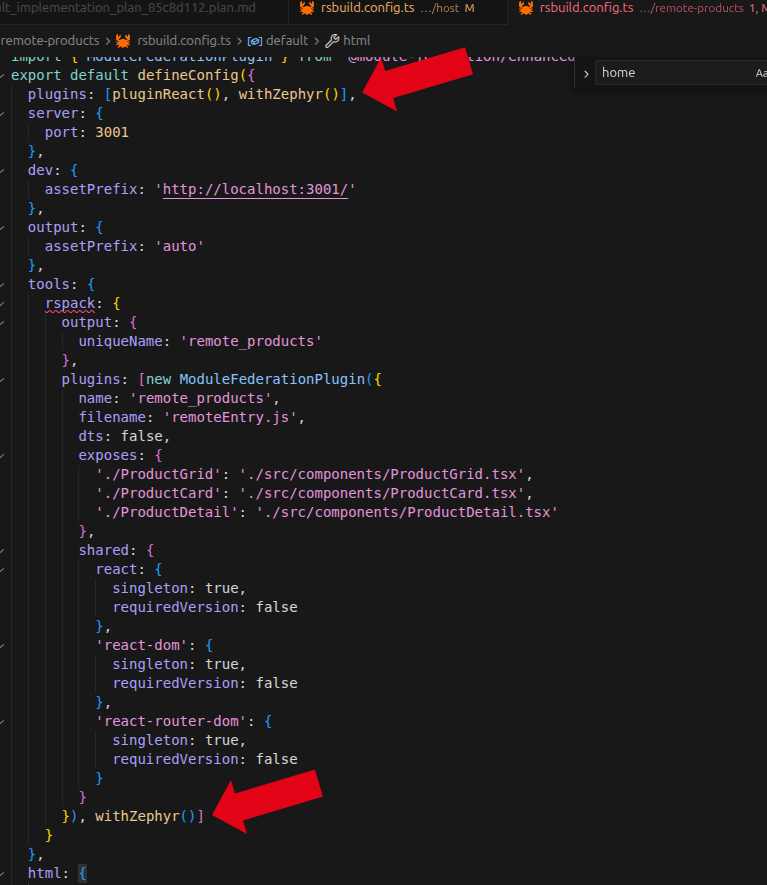

## Process to test Zephyr Cloud

First, I had to understand what Zephyr actually is. At first glance I thought it was a tool to help deploy cloud resources across different cloud providers, but after digging in I realized it's a tool to improve deployment for module federation components.

I did some research on module federation and how it applies to microfrontends, since I'd never worked with it before. I decided to create a simple application with a host and a remote component (a products list) to get a feel for how it works.

After building that application with NX and RSpack (the recommended libs), I tested adding Zephyr Cloud to the existing application and noted the challenges throughout the process.

### Adding Zephyr to an existing project

I found the documentation at https://docs.zephyr-cloud.io/integrations/react-rspack-nx and ran `npx with-zephyr` in the root. The installation was smooth. After that I jumped to part 6 of the documentation I got lost because I had to spend some time figuring out which step I should take after the quick setup.

I followed the steps, building the remote application first, and got this error:

> `[rsbuild:plugin] "zephyr-rsbuild-plugin" appears to be an Rsbuild plugin. It cannot be used as an Rspack plugin.`

After debugging, I realized the quick setup had added the `withZephyr` plugin twice in my `rsbuild.config` file. Removing the duplicate call fixed it for both the remote and host applications.

### Problems after a successful build

- My projects and applications didn't appear in Zephyr Cloud, even after refreshing the page. I had to sign out and sign in again to see my first deploy.
- I don't have a separate rsbuild config file for production, so I created one. But NX used its cache for the deploy and nothing changed. After disabling the NX cache I was able to see the latest version working.

### Thoughts and recommendations

- **Zephyr Cloud app -- live updates:** The dashboard could use a polling or push mechanism to check for updates, or at least fetch new projects on page refresh. Since this happened on my first deploy, it could hurt the first-time experience and increase churn.
- **Documentation gaps:** I had to make assumptions to connect the dots between steps. An end-to-end walkthrough showing the full path from setup to a visible deploy would help a lot.
- **NX cache hint:** Adding a note about NX caching in the documentation would help users avoid skipped deployments.

### Overall impression

Zephyr Cloud is a solid tool for building microfrontends and simplifying deployment. Even as someone who had never worked with module federation before, I found it easy to identify versions and dependencies between the remote and host apps.
